# Day 6 — Three Splunk Threat Hunts

Prepared from the queries and result screenshots reviewed during the lab session on 21 September 2026.

## Scope and evidence standard

This is a training investigation, not a production incident. Hunts 1 and 2 use the Splunk: Exploring SPL Windows dataset; Hunt 3 uses the separate Day 5 Splunk Basics — Did you SIEM? firewall dataset. These datasets do not form one attack timeline.

Results below were observed in screenshots supplied by the analyst. Queries were run by the analyst in the lab; the report author did not access Splunk directly. The supporting screenshots are embedded under the finding they document; select an image to inspect the original full-resolution file.

Times are Splunk-displayed times unless stated otherwise. The Windows screenshots contain differences between displayed times and embedded UTC timestamps; timezone normalization was not completed. No precise cross-source timing claim is made.

| Hunt | Result | Confidence and limit |
|---|---|---|
| LSASS access | 25 matching process-access events | Access observed; credential dumping unconfirmed |
| Remote account activity | Matching WMIC command, account creation and deletion | Account changes confirmed; authorization and account use unknown |
| Possible exfiltration | 285 allowed events, 126,167 recorded bytes to a C2-labelled destination | Traffic observed; sensitive-data exfiltration unconfirmed |

## Hunt 1 — Investigating LSASS access

### Hypothesis

A process may have accessed LSASS as part of credential theft. Investigate the accessing process and supporting activity before classifying the access as credential dumping.

### Data and queries

The inventory showed 12,256 events in `windowslogs` with sourcetype `_json`, and 2,000 events in `vpnlogs` with sourcetype `kv`.

```spl
index=* earliest=0 latest=now
| stats count AS events by index sourcetype
| sort - events
```

The initial hunt returned 25 events:

```spl
index=windowslogs earliest=0 latest=now
EventID=10 TargetImage="*lsass.exe"
| sort 0 _time
| table _time Hostname SourceImage TargetImage GrantedAccess SourceProcessGUID TargetProcessGUID
```

An attempted correlation to EventID 1 using `ProcessGuid` returned no matches. Separate raw-event inspection confirmed that process-creation events and the `ProcessGuid` field existed in the dataset. This did not establish that creation events for the specific accessing processes were available.

The broader GUID search returned 180 related records:

```spl
index=windowslogs earliest=0 latest=now
[
    search index=windowslogs earliest=0 latest=now
    EventID=10 TargetImage="*lsass.exe"
    | dedup SourceProcessGUID
    | rename SourceProcessGUID AS search
    | table search
]
| sort 0 _time
| table _time Hostname EventID Image SourceImage TargetImage CommandLine ParentImage ProcessGuid SourceProcessGUID
```

### Observations

- Displayed date: 15 April 2022, approximately 08:06:02–08:06:43.
- Source image: `C:\windows\system32\svchost.exe`.
- Target image: `C:\windows\system32\lsass.exe`.
- Hostname labels included `James.browne` and `Micheal.Beaven`; these labels were not treated as executing usernames.
- The visible access masks were `0x1000` and `0x2000`. These values alone were not treated as proof of memory dumping.
- Related records included process access, file creation and registry activity. The 180-record result is not a count of credential-dumping attempts.

### Finding and limitations

LSASS process access was observed, but credential dumping was not confirmed. The reviewed evidence did not establish a dump file, a credential-dumping command, or a malicious accessing process. A familiar executable name is also insufficient to establish benign behavior.

The later 1,271-event search had lost the GUID filter and therefore cannot be used as evidence specifically associated with the LSASS-accessing processes. Its WMIC result became a separate lead for Hunt 2.

### Recommended follow-up in a real investigation

Retrieve process ancestry and full endpoint telemetry for the accessing GUIDs; examine access rights, dump-file artifacts and executable integrity. Escalate if corroborating evidence supports credential theft. No containment action was performed in this lab.

### Evidence references

**25 LSASS-access events**

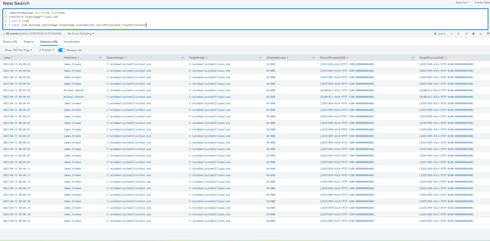

**Initial GUID correlation returned zero**

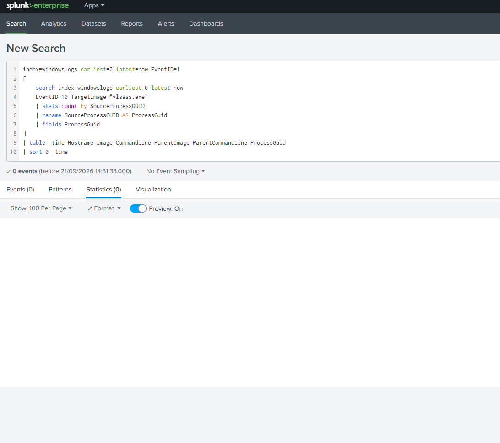

**Sample process-creation records**

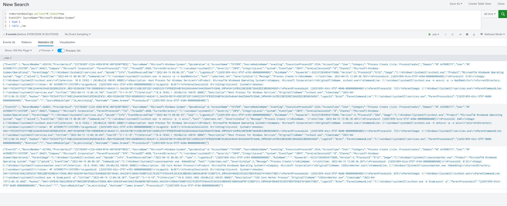

**180 GUID-related records**

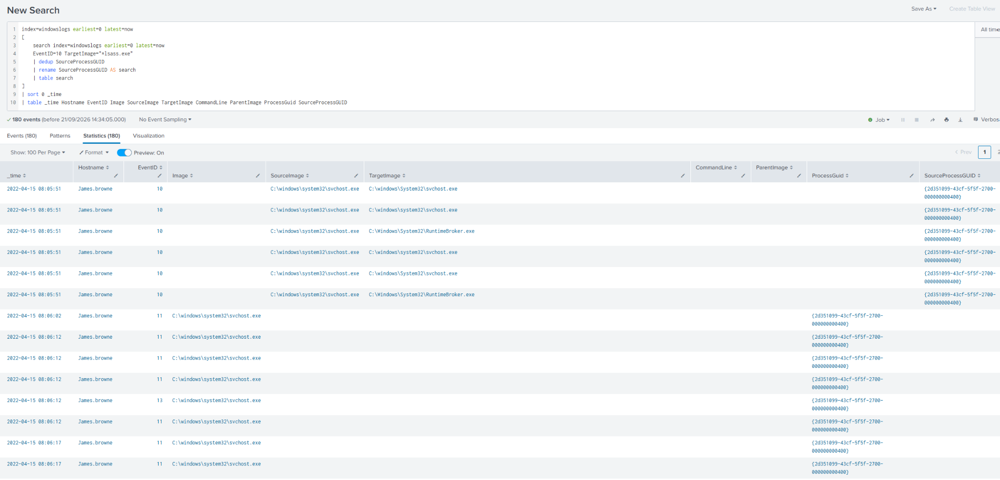

## Hunt 2 — Remote account creation and deletion

### Hypothesis

An account may have been created remotely through WMIC for unauthorized access. Correlate the process command with account-management records and distinguish the new local identity from similarly named accounts.

### Queries

```spl
index=windowslogs earliest=0 latest=now
EventID=1 Image="*WMIC.exe"
| sort 0 _time
| table _time Hostname User Image CommandLine ParentImage ParentCommandLine ProcessGuid
```

This returned one event. PowerShell launched WMIC under `Cybertees\James`; its command targeted `WORKSTATION6` and requested creation of `Alberto` through `net user /add`. The plaintext password is intentionally omitted from this write-up.

```spl
index=windowslogs earliest=0 latest=now
SourceName="Microsoft-Windows-Security-Auditing" EventID=4720
| table _time Hostname SubjectDomainName SubjectUserName TargetDomainName TargetUserName TargetSid EventType
```

The creation record identified `WORKSTATION6\Alberto`, created by `Cybertees\James`, with SID `S-1-5-21-1969843730-2406867588-1543852148-1000`.

```spl
index=windowslogs earliest=0 latest=now
"S-1-5-21-1969843730-2406867588-1543852148-1000"
| sort 0 RecordNumber
| table _time RecordNumber EventID Hostname SubjectUserName TargetDomainName TargetUserName MemberSid
```

### Observations

The WMIC process event displayed `2022-04-15 08:06:01`. Five SID-related account records displayed `08:06:02`, with the following recorded order:

| RecordNumber | EventID | Activity |
|---|---|---|
| 56078 | 4728 | Group member added |
| 56079 | 4720 | Account created |
| 56080 | 4724 | Password-reset attempt |
| 56081 | 4729 | Group member removed |
| 56082 | 4726 | Account deleted |

All five records showed `James` as the subject username and `Micheal.Beaven` as the Hostname label. `TargetDomainName=WORKSTATION6` was retained separately rather than replacing the Hostname field.

The recorded group-add entry precedes the creation entry. Preserve this observed ordering rather than rewriting it into an assumed lifecycle. Identical displayed timestamps do not establish the account's precise lifetime. The password-reset record was not independently checked for its success outcome.

A broader search for `Alberto` returned 347 records, including activity as `Cybertees\Alberto`. That domain identity was not assumed to be the newly created `WORKSTATION6\Alberto` account. The SID search returned account-management records, not evidence of a successful login using the new account.

### Finding and limitations

Account creation and deletion are confirmed by the security records. The matching target, account name, actor and adjacent displayed times strongly support a relationship between the WMIC command and account creation. Authorization, subsequent account use, and malicious intent remain unknown. Deletion alone does not prove attacker cleanup.

### Recommended follow-up in a real investigation

Validate whether James had an approved administrative task. Check target-host authentication records using the new SID and examine the PowerShell parent activity. If unauthorized, escalate for account and endpoint containment under the incident-response procedure. No account changes or containment actions were performed in this lab.

### Evidence references

**WMIC command, acting user and PowerShell parent**

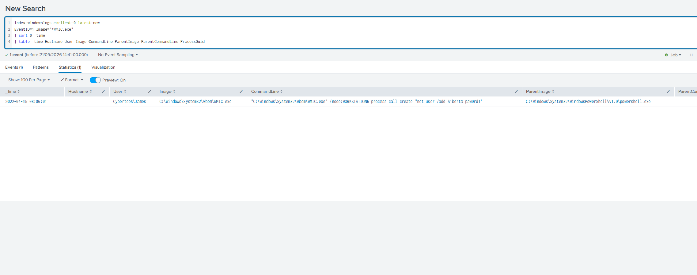

**Raw account-creation record**

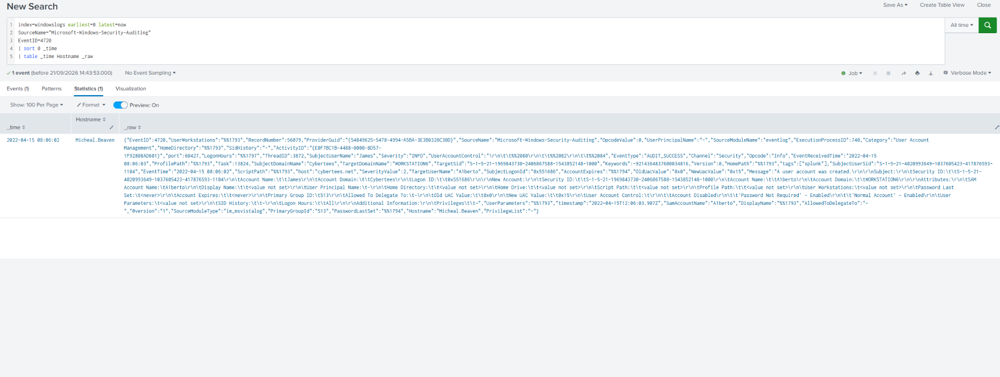

**Focused account-creation fields**

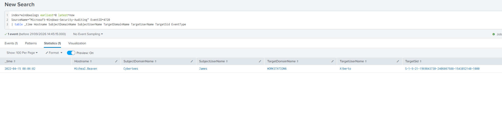

**Five SID-related records in record-number order**

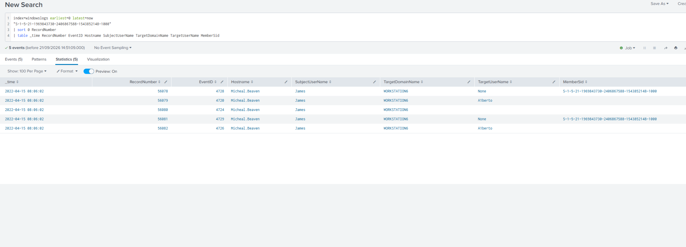

## Hunt 3 — Assessing possible exfiltration through C2 traffic

### Hypothesis

The lab web server may have transferred data to a command-and-control destination. Identify permitted traffic, calculate the recorded volume and distinguish communication from proven sensitive-data exfiltration.

### Data and queries

This hunt uses the separate Day 5 dataset: `index=main`, `sourcetype=firewall_logs`. Raw samples contained `src_ip`, `dest_ip`, `dest_port`, `action`, `bytes_transferred` and `reason`.

```spl
index=main sourcetype="firewall_logs" earliest=0 latest=now
| head 3
| table _raw
```

Raw samples showed source `10.10.1.5`. The room text had previously mentioned `10.10.1.15`; the investigation used the actual recorded address. Sample blocked events were not counted as evidence of successful transfers.

An exploratory aggregation with `spath` produced inconsistent totals: one grouped row showed 2,280 events despite 1,572 source events overall. Its 2,018,672-byte result was rejected. The exact extraction mechanism causing inflation was not independently verified.

The simpler query, without the additional extraction, returned the final observed result:

```spl
index=main sourcetype=firewall_logs earliest=0 latest=now dest_ip="198.51.100.55" action=ALLOWED
| stats count AS events sum(bytes_transferred) AS total_bytes
```

### Observations

| Item | Observed value |
|---|---|
| Destination | 198.51.100.55 |
| Action | ALLOWED |
| Matching events | 285 |
| Sum of recorded bytes_transferred | 126,167 bytes |
| Source shown in exploratory grouping | 10.10.1.5 |
| Destination port shown in exploratory grouping | 8080 |
| Lab reason label | C2_CONTACT |

The final query filters destination and action, but not source or port. Its total is therefore reported strictly as the allowed-event total to the destination. Source and port context come from the earlier grouping. A source-and-port-specific total was not separately rerun.

An initial zero-result query searched only September 2026. Adding `earliest=0 latest=now` included the older dataset and returned results. Sample firewall timestamps were in October 2025.

### Finding and limitations

The logs contain 285 allowed events to the lab's C2-labelled destination, with 126,167 bytes recorded. This supports suspicious permitted communication and a possible exfiltration lead. It does not establish the contents transferred, the number of unique sessions, or that all recorded bytes represent outbound sensitive data. The C2 classification is the lab's `reason` label, not independently obtained threat intelligence.

The final aggregate was verified in a screenshot. Raw-record uniqueness and the byte field's directional semantics were not independently validated, so the result is described as a sum of recorded bytes rather than a measured stolen-data volume.

### Recommended follow-up in a real investigation

Correlate the traffic with web requests and endpoint processes, confirm byte-field semantics, and inspect proxy or packet evidence for transferred content. Validate the destination classification and approved communications before choosing containment actions. No blocking or host isolation was performed in this lab.

### Evidence references

**Raw firewall samples**

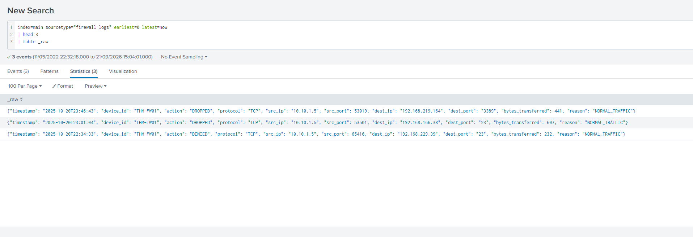

**C2-labelled destination and rejected inflated totals**

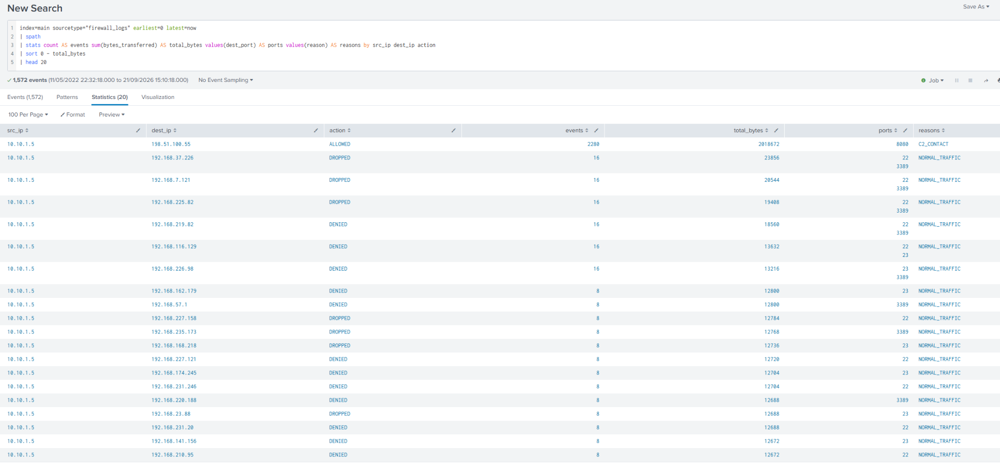

**Zero results under the wrong time range**

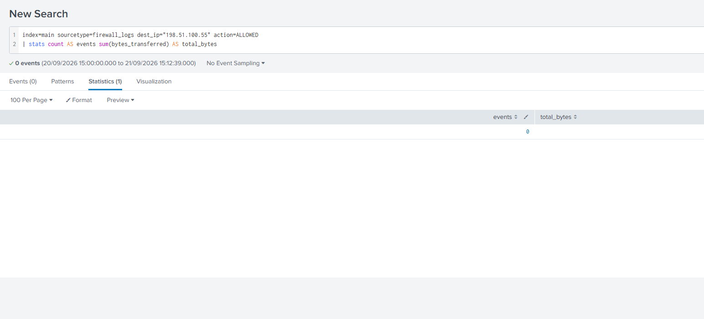

**Final 285-event, 126,167-byte result**

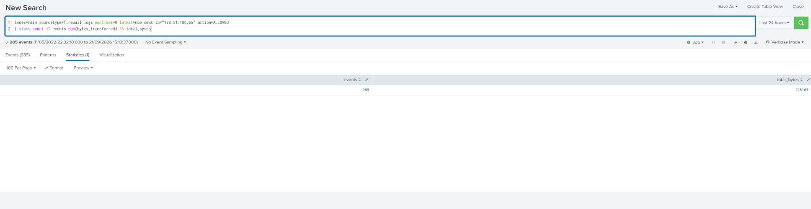

## Completion and analyst reflection

Three practical hunts and their write-ups are complete. Hunt 1 remains inconclusive for credential dumping; Hunt 2 confirms account changes without establishing malicious intent; Hunt 3 establishes C2-labelled communication without proving sensitive-data exfiltration. These are valid, distinct investigation outcomes.

Key lessons demonstrated: verify dataset and time range; inspect actual field names; correlate identities using SIDs and processes using GUIDs; validate aggregates against source-event counts; and separate observed actions from inferred intent or impact.

The next project stage is Day 7: turn selected behaviors into detection queries, document false positives and thresholds where appropriate, and label each detection according to its actual test coverage.
